<div align="center">



# Living Scene

**Your README, synced to your actual weather.**

Every few hours a GitHub Action asks Open-Meteo what the sky looks like where you
live, and repaints your profile banner to match. Rain outside means rain on your
README. One Python file, zero dependencies, nothing to sign up for.


</div>

---

## The six skies

Weather codes collapse into six states, each painted straight into your banner:
hovering clouds that drift across the sun, rain that thins out at the soil line,
snow over the whole scene, mist pooling between the stems, lightning.

| | |
|---|---|
| **Clear** <br>  | **Clouds** <br>  |
| **Rain** <br>  | **Snow** <br>  |
| **Fog** <br>  | **Storm** <br>  |

Every scene also renders a night variant: the palette shifts, clouds go slate,
a moon and stars come out. Drop both into a `<picture>` and the banner follows
whichever theme the *viewer* has set:

<div align="center">

</div>

## The four gardens

The footer tracks the season instead of the weather, and a cat lives in it —
eleven hand-keyframed poses on a 75-second loop. It trots in, spots a butterfly,
crouches, pounces, chases, stares up at something it cannot reach, tries twice to
jump for it, gives up, sits, stretches, and bolts off-screen.

<div align="center">


</div>

---

## Quick start

**1.** Put a banner in your profile repo (the one named after your username).
Copy [`examples/header.svg`](examples/header.svg) as `header.svg` and change the
name in it, or use any SVG of your own and add an empty block where the sky is:

```xml
<!--WEATHER--><!--/WEATHER-->
```

The weather is painted between those markers; everything else in the file is
yours and stays untouched. Layouts assume a 900×300 canvas and scale to whatever
`viewBox` your file declares.

**2.** Add `.github/workflows/scene.yml`:

```yaml
name: Living scene
on:
  schedule:
    - cron: "23 */3 * * *"
  workflow_dispatch:

permissions:
  contents: write

jobs:
  scene:
    runs-on: ubuntu-latest
    steps:
      - uses: actions/checkout@v4
      - uses: yuki4266/living-scene@v1
        with:
          lat: "35.99"          # your coordinates
          lon: "-78.90"
          tz: America/New_York  # your timezone
          header: header.svg    # the banner from step 1
          sky: "false"
```

**3.** Reference the files in your `README.md`:

```html
<div align="center">
  <picture>
    <source media="(prefers-color-scheme: dark)" srcset="header-night.svg" />
    
  </picture>
</div>

<!-- your actual content -->

<div align="center">
  <picture>
    <source media="(prefers-color-scheme: dark)" srcset="garden-footer-night.svg" />
    
  </picture>
</div>
```

**4.** Run the workflow once by hand from the Actions tab. After that it keeps
itself current: `header.svg`, `header-night.svg` and the two footers are
committed whenever the scene changes, and only then.

> Find your coordinates by right-clicking your city in Google Maps — the first
> number is the latitude.

<details>
<summary>Prefer a strip under a banner you already have?</summary>
<br/>

Leave `header` and `sky` out and the action writes a standalone 900×70 sky
strip instead (`sky.svg`, `sky-night.svg`), which you place under your banner:


```html
<picture>
  <source media="(prefers-color-scheme: dark)" srcset="sky-night.svg" />
  
</picture>
```
</details>

## Running it locally

No install step, no `pip install`. Python 3.9 or newer:

```bash
curl -O https://raw.githubusercontent.com/yuki4266/living-scene/main/gen_scene.py

python3 gen_scene.py --lat 35.99 --lon -78.90 --tz America/New_York
```

Pin a scene to see one you would otherwise have to wait for:

```bash
python3 gen_scene.py --weather snow --season winter --force
python3 gen_scene.py --weather storm --season autumn --force
```

Paint into a banner instead of writing the strip:

```bash
python3 gen_scene.py --header header.svg --skip-sky --weather fog --season autumn --force
```

The banner is updated in place and `header-night.svg` is written next to it; the
two garden footers land in the output directory.

## Options

Every flag has a `SCENE_*` environment variable equivalent, which is what the
Action uses under the hood.

| Flag | Env | Default | |
|---|---|---|---|
| `--lat` | `SCENE_LAT` | `40.7128` | Latitude for the weather lookup |
| `--lon` | `SCENE_LON` | `-74.0060` | Longitude for the weather lookup |
| `--tz` | `SCENE_TZ` | `America/New_York` | IANA timezone, used to pick the season |
| `--hemisphere` | `SCENE_HEMISPHERE` | `north` | `south` flips the season mapping |
| `--weather` | — | *(live)* | Pin to `clear`/`clouds`/`rain`/`snow`/`fog`/`storm` |
| `--season` | — | *(from date)* | Pin to `spring`/`summer`/`autumn`/`winter` |
| `--header` | `SCENE_HEADER` | *(none)* | Your SVG with a `<!--WEATHER--><!--/WEATHER-->` block; painted in place |
| `--header-night` | `SCENE_HEADER_NIGHT` | `<header>-night.svg` | Where the night variant of the header goes |
| `--skip-sky` | `SCENE_SKY=false` | off | Do not write the standalone strip |
| `--out-dir` | `SCENE_OUT_DIR` | `.` | Where the strip and the footers are written |
| `--state` | `SCENE_STATE` | `.github/scene-state` | Records the last scene, so nothing changes when nothing changed |
| `--force` | — | off | Re-render even if unchanged |

Southern hemisphere, in full:

```yaml
      - uses: yuki4266/living-scene@v1
        with:
          lat: "-33.87"
          lon: "151.21"
          tz: Australia/Sydney
          hemisphere: south
```

## How it works

**Weather.** One unauthenticated call to [Open-Meteo](https://open-meteo.com/) —
no API key, no account. The WMO `weather_code` it returns collapses into six
buckets: `>= 95` is a storm, `71/73/75/77/85/86` is snow, `51–67` and `80–82` are
rain, `45/48` is fog, `1/2/3` is cloud, and anything else is clear.

**Painting the banner.** The header is your file. The action finds the
`<!--WEATHER-->…<!--/WEATHER-->` block, replaces what is between the markers, and
leaves every other byte alone, so you can keep drawing in it. Clouds hover in
place with a slow sway rather than crossing the canvas, so the composition is
balanced whenever someone looks; rain is masked so drops appear below the cloud
band and fade at the soil line; fog is a handful of wide, heavily blurred
ellipses pooling low between the stems. The marker records what was painted
(`<!--WEATHER rain-autumn day-->`), so a banner with fresh, empty markers is
painted on the next run even if the weather has not moved.

**Drawing.** The SVG is built by string concatenation. There is no SVG library,
no headless browser, no rasterisation step — just Python writing out paths and
`<animateTransform>` elements. Rain is a straight translate down the strip.
Snow uses a three-point `keyTimes` path so flakes drift sideways as they fall.
Fog is four translucent bands easing back and forth in alternating directions,
each faded out at both ends by a gradient so it has no visible edge. Lightning is
a full-width flash rect and a bolt path sharing one `keyTimes` track, struck
twice — a bright hit, then a dimmer afterflash.

**Night.** Rather than maintaining two palettes by hand, the day SVG is generated
first and then run through a regex that rewrites every hex colour through a
lookup table. One source of truth, two files out.

**Not committing noise.** Output is deterministic: every `random` call is seeded
from the `(weather, season)` pair, so the same scene always produces the same
bytes. The last-rendered scene is written to `.github/scene-state`, and if it
matches, the run exits without touching a file. A profile that sits under clear
skies for a week produces zero commits, not 56 identical ones.

**When the API is down.** The weather lookup degrades to the last known scene
instead of failing the workflow, so a bad afternoon at Open-Meteo does not turn
into a red X on your profile.

## Why the SVG is animated on GitHub

GitHub strips `<script>` from SVGs but permits SMIL (`<animate>`,
`<animateTransform>`). Everything here is SMIL, which is why it moves in a README
where a CSS or JS animation would not.

## Credits

Weather data from [Open-Meteo](https://open-meteo.com/), free for
non-commercial use and delightfully key-free.

## License

MIT — see [LICENSE](LICENSE). Take the cat.
