<div align="center">


# Living Scene

**Your README, synced to your actual weather.**

Every few hours a GitHub Action asks Open-Meteo what the sky looks like where you
live, and redraws your profile banner to match. Rain outside means rain on your
README. One Python file, zero dependencies.


</div>

---

## The six skies

Weather codes collapse into six states. Each one is a different animated SVG —
drifting clouds, falling rain, three-stage snowfall, rolling fog banks, lightning.

| | |
|---|---|
| **Clear** <br>  | **Clouds** <br>  |
| **Rain** <br>  | **Snow** <br>  |
| **Fog** <br>  | **Storm** <br>  |

Every scene also renders a night variant. Drop both into a `<picture>` and the
banner follows whichever theme the *viewer* has set:

<div align="center">

</div>

## The four gardens

The footer tracks the season instead of the weather, and a cat lives in it —
eleven hand-keyframed poses on a 75-second loop. It trots in, spots a butterfly,
crouches, pounces, chases, stares up at something it cannot reach, tries twice to
jump for it, gives up, sits, stretches, and bolts off-screen.

<div align="center">






</div>

---

## Quick start

**1.** Add `.github/workflows/scene.yml` to your profile repo (the one named after
your username):

```yaml
name: Living scene
on:
  schedule:
    - cron: "23 */3 * * *"
  workflow_dispatch:

permissions:
  contents: write

jobs:
  scene:
    runs-on: ubuntu-latest
    steps:
      - uses: actions/checkout@v4
      - uses: yuki4266/living-scene@v1
        with:
          lat: "35.99"          # your coordinates
          lon: "-78.90"
          tz: America/New_York  # your timezone
```

**2.** Reference the generated files in your `README.md`:

```html
<div align="center">
  <picture>
    <source media="(prefers-color-scheme: dark)" srcset="sky-night.svg" />
    
  </picture>
</div>

<!-- your actual content -->

<div align="center">
  <picture>
    <source media="(prefers-color-scheme: dark)" srcset="garden-footer-night.svg" />
    
  </picture>
</div>
```

**3.** Run the workflow once by hand from the Actions tab. After that it keeps
itself current.

> Find your coordinates by right-clicking your city in Google Maps — the first
> number is the latitude.

## Running it locally

No install step, no `pip install`. Python 3.9 or newer:

```bash
curl -O https://raw.githubusercontent.com/yuki4266/living-scene/main/gen_scene.py

python3 gen_scene.py --lat 35.99 --lon -78.90 --tz America/New_York
```

Pin a scene to see one you would otherwise have to wait for:

```bash
python3 gen_scene.py --weather snow --season winter --force
python3 gen_scene.py --weather storm --season autumn --force
```

Four files land in the output directory: `sky.svg`, `sky-night.svg`,
`garden-footer.svg`, `garden-footer-night.svg`.

## Options

Every flag has a `SCENE_*` environment variable equivalent, which is what the
Action uses under the hood.

| Flag | Env | Default | |
|---|---|---|---|
| `--lat` | `SCENE_LAT` | `40.7128` | Latitude for the weather lookup |
| `--lon` | `SCENE_LON` | `-74.0060` | Longitude for the weather lookup |
| `--tz` | `SCENE_TZ` | `America/New_York` | IANA timezone, used to pick the season |
| `--hemisphere` | `SCENE_HEMISPHERE` | `north` | `south` flips the season mapping |
| `--weather` | — | *(live)* | Pin to `clear`/`clouds`/`rain`/`snow`/`fog`/`storm` |
| `--season` | — | *(from date)* | Pin to `spring`/`summer`/`autumn`/`winter` |
| `--out-dir` | `SCENE_OUT_DIR` | `.` | Where the four SVGs are written |
| `--state` | `SCENE_STATE` | `.github/scene-state` | Records the last scene, so nothing changes when nothing changed |
| `--force` | — | off | Re-render even if unchanged |

Southern hemisphere, in full:

```yaml
      - uses: yuki4266/living-scene@v1
        with:
          lat: "-33.87"
          lon: "151.21"
          tz: Australia/Sydney
          hemisphere: south
```

## How it works

**Weather.** One unauthenticated call to [Open-Meteo](https://open-meteo.com/) —
no API key, no account. The WMO `weather_code` it returns collapses into six
buckets: `>= 95` is a storm, `71/73/75/77/85/86` is snow, `51–67` and `80–82` are
rain, `45/48` is fog, `1/2/3` is cloud, and anything else is clear.

**Drawing.** The SVG is built by string concatenation. There is no SVG library,
no headless browser, no rasterisation step — just Python writing out paths and
`<animateTransform>` elements. Rain is a straight translate down the strip.
Snow uses a three-point `keyTimes` path so flakes drift sideways as they fall.
Fog is four translucent bands easing back and forth in alternating directions,
each faded out at both ends by a gradient so it has no visible edge. Lightning is
a full-width flash rect and a bolt path sharing one `keyTimes` track, struck
twice — a bright hit, then a dimmer afterflash.

**Night.** Rather than maintaining two palettes by hand, the day SVG is generated
first and then run through a regex that rewrites every hex colour through a
lookup table. One source of truth, two files out.

**Not committing noise.** Output is deterministic: every `random` call is seeded
from the `(weather, season)` pair, so the same scene always produces the same
bytes. The last-rendered scene is written to `.github/scene-state`, and if it
matches, the run exits without touching a file. A profile that sits under clear
skies for a week produces zero commits, not 56 identical ones.

**When the API is down.** The weather lookup degrades to the last known scene
instead of failing the workflow, so a bad afternoon at Open-Meteo does not turn
into a red X on your profile.

## Why the SVG is animated on GitHub

GitHub strips `<script>` from SVGs but permits SMIL (`<animate>`,
`<animateTransform>`). Everything here is SMIL, which is why it moves in a README
where a CSS or JS animation would not.

## Credits

Weather data from [Open-Meteo](https://open-meteo.com/), free for
non-commercial use and delightfully key-free.

## License

MIT — see [LICENSE](LICENSE). Take the cat.
